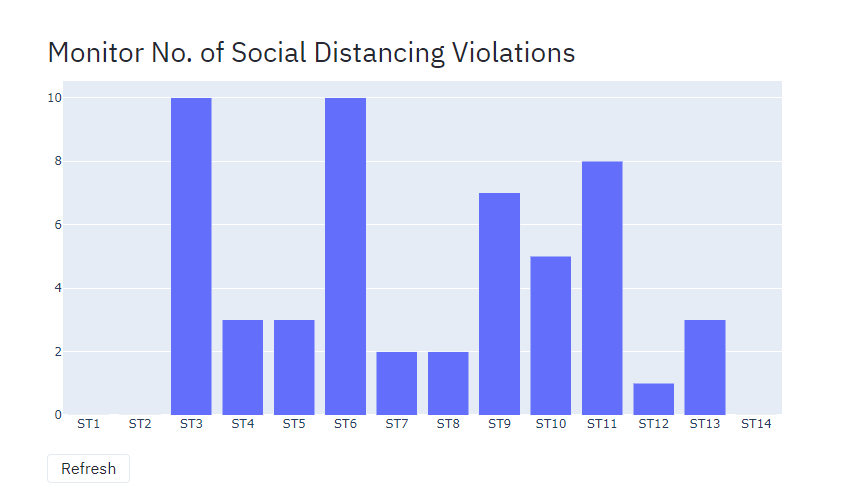

# Shopping Mall Covid Monitor
This is the front-end part for the Application being made as part of #BuildwithAI hackathon.
It fetches the Data from the [Backend](https://github.com/Build-with-AI-a-team/mall-api-server) using APIs

### Architecture
- Frontend - Built with [Streamlit](https://www.streamlit.io/). It fetches the data from the Backend APIs. It also has a demo mode where it shows the fuctionality against randomly generated data.
- Backend - Built with Python [Flask](https://flask.palletsprojects.com/en/1.1.x/) and [TinyDB](https://tinydb.readthedocs.io/en/stable/). It hosts APIs to update and get data from the database.
- ML Model - Built with Python. It gets the data from the Cameras, and runs the algorithms to get the output. The Output is then sent to the Backend database using the APIs.
  

## Screenshots
### Density Tracker

### Face Mask Detection

### Social Distancing Monitor

### Team Members
[Ignacio Amat](https://github.com/IgnacioAmat)  
[Dhruv Sheth](https://github.com/dhruvsheth-ai)  
[Tugrul Guner](https://github.com/tugrulguner)  
[Parijat Khan](https://github.com/Parijat29)  
[Ramona Rajagopalan](https://www.linkedin.com/in/ramona-rajagopalan/)  
[Arijit Das](https://github.com/arijitdas123student)  
[Deepak Vohra](https://www.linkedin.com/in/vohra-deepak/)